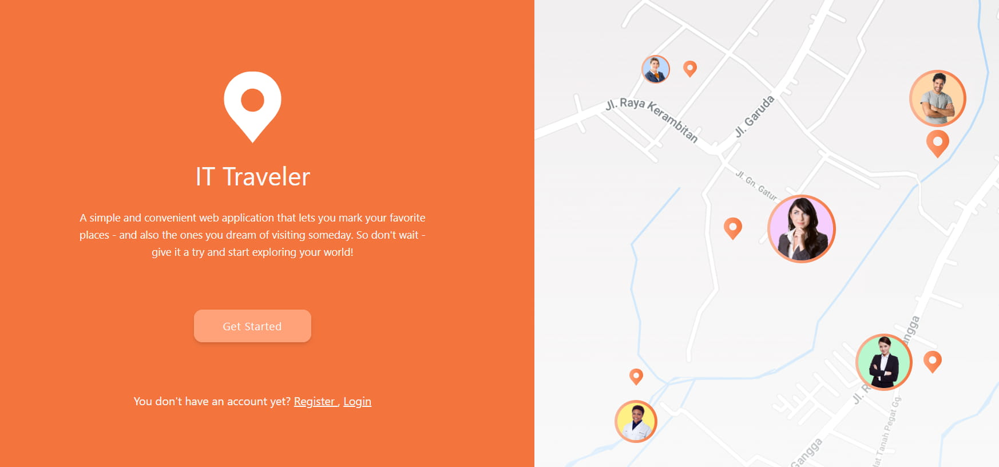

#

# 🌍 IT Traveler

**IT Traveler** is a personal travel companion web app designed to capture your memories, dreams, and favorite places—whether you've visited them or hope to one day. With an intuitive interface and interactive map, it helps you visualize and organize your travel story.

## 🛠️ Technologies

- **Vue.js 3** — modern JavaScript framework
- **Tailwind CSS 4.1** — utility-first CSS for responsive design
- **Mapbox** — interactive map with custom marker support

## 🔐 Features

- **Routing**:
  - Public routes
  - Private routes (accessible only to authenticated users)
  - Protected routes with access control

- **Forms**:
  - Registration and login
  - Add a favorite place
  - Edit saved locations
  - Upload a small photo of the location
  - Delete favorite place

- **Mapbox Integration**:
  - Users can place a marker on the map to save a favorite spot
  - Visualize personal locations in an interactive format

## 🗺️ Interface Preview

<div  style="text-align: center">
  
  <p><em>Screenshot: Map view with a marker for to add a favorite place</em></p>
</div>

## 🌍 Purpose

To provide travelers with a space to preserve their memories, dreams, and favorite destinations. **IT Traveler** is more than a map it's your personal travel journal.

## 📦 Installation

```bash
git clone https://github.com/username/it-traveler.git
cd it-traveler
npm install
npm run dev


```

## Customize configuration

See [Vite Configuration Reference](https://vite.dev/config/).

## Project Setup

```sh
npm install
```

### Compile and Hot-Reload for Development

```sh
npm run dev
```

### Compile and Minify for Production

```sh
npm run build
```

### Lint with [ESLint](https://eslint.org/)

```sh
npm run lint
```
